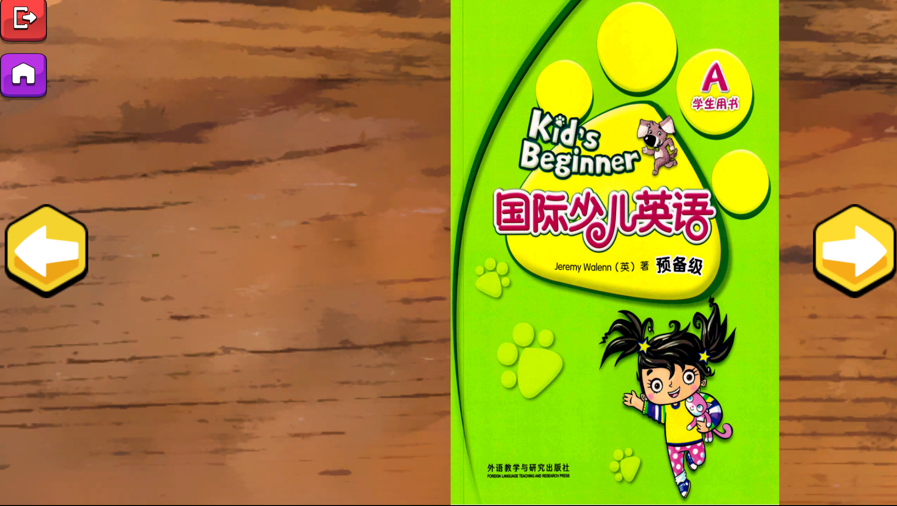
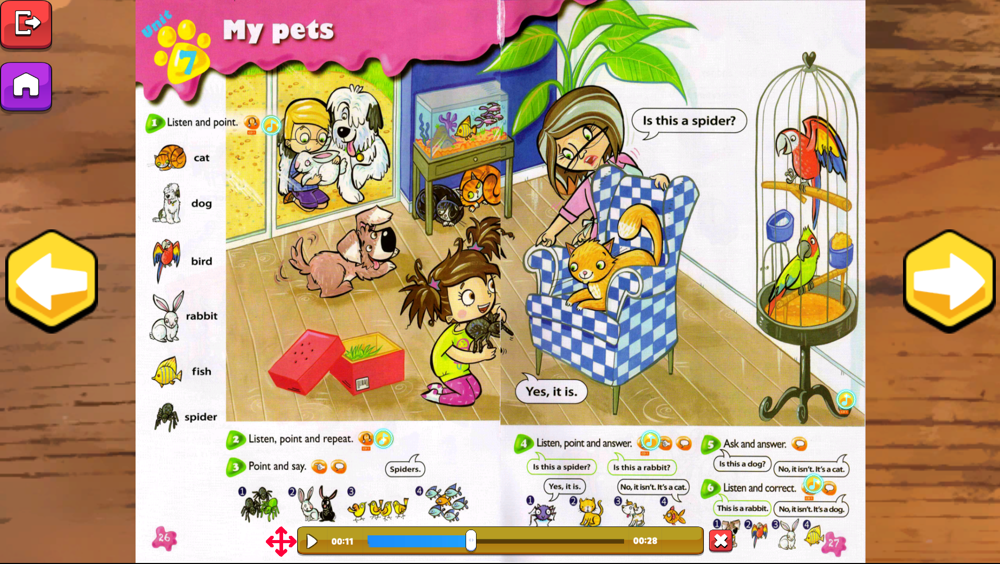

# ESL Games Collection

## Table of contents

- [Overview](#overview)
  - [Links](#links)
  - [Built with](#built-with)
- [Author](#author)
- [Acknowledgments](#acknowledgments)

## Overview

I created this app to solve a problem in our English school. The students had no way to practice or read their books by themselves at home. They had to have their parents help them read it or help them play the CD that came with the book. The students who had very attentive parents had a huge unfair advantage over other students. So I created an android app that students could use at home without their parents help. The students can browse the book and click the music icons to hear the CD audio play. Teachers could also benefit from this app during class. This app also would run on the classroom smartboards. Teachers no longer had to make powerpoints of book pages and didn't have to waste class time trying to find the correct audio file on the CD. In a fast paced ESL classroom, you quickly lose the energy of the class by fumbling with a CD player. The app has touch controls. You can zoom in and pan the screen. You can also swipe to turn the page.

|                                      |                                          |
| :----------------------------------: | :--------------------------------------: |
|  |  |

### Links

- GitHub URL: [https://github.com/seanred360/Kid-s-Beginner-Book]
- Live Site URL: [https://seanred.itch.io/kba]

### Built with

- [Unity](https://unity.com/) - Game engine

## Author

- Website - [seanred.io](https://seanred.io)
- GitHub - [seanred360](https://github.com/seanred360)

## Acknowledgments

- Mei Han
- Ivy International English
- My co-teachers